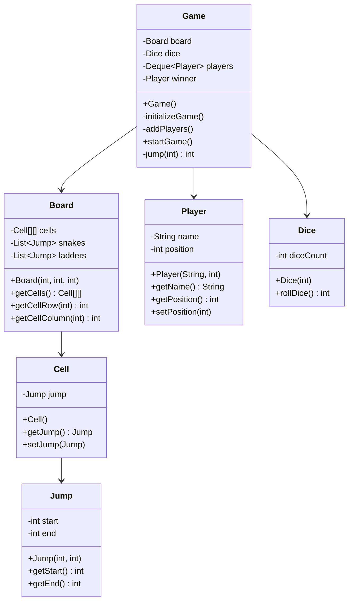

# Snake and Ladder Game

A Java implementation of the classic Snake and Ladder board game.

## Features
- 10x10 game board (positions 0-99)
- Two players with turn-based gameplay
- 5 snakes and 4 ladders randomly placed
- Single dice rolling mechanism
- Boundary validation (exact position 99 to win)
- Logging for game events
- Internationalization support

## How to Play
1. Players start at position 0
2. Players take turns rolling the dice (1-6)
3. Move forward based on dice value
4. If dice roll exceeds position 99, player stays at current position
5. Landing on a ladder moves you up
6. Landing on a snake moves you down
7. First player to reach exactly position 99 wins

## Running the Game
```bash
mvn compile exec:java -Dexec.mainClass="org.deepak.Main"
```

## Project Structure
```
src/main/java/org/deepak/
├── controller/
│   └── Game.java          # Main game controller with game logic
├── dto/
│   ├── Board.java         # Game board with snakes and ladders
│   ├── Cell.java          # Individual board cell
│   ├── Dice.java          # Dice rolling mechanism
│   ├── Jump.java          # Snake/ladder jump logic
│   └── Player.java        # Player data model
└── Main.java              # Application entry point
```

## Class Diagram



## Design Patterns Used

### 1. **Facade Pattern**
- **Class**: `Game`
- **Purpose**: Provides a simplified interface to the complex subsystem of board, dice, and players
- **Implementation**: The Game class orchestrates all game components and hides complexity from clients

### 2. **Composition Pattern**
- **Classes**: `Board` contains `Cell[][]`, `Cell` contains `Jump`
- **Purpose**: Creates a "has-a" relationship where objects are composed of other objects
- **Implementation**: Board is composed of cells, and cells can contain jumps (snakes/ladders)

### 3. **Data Transfer Object (DTO) Pattern**
- **Classes**: `Player`, `Dice`, `Cell`, `Jump`
- **Purpose**: Encapsulates data and provides simple getter/setter methods
- **Implementation**: Simple POJOs that carry data between different layers
